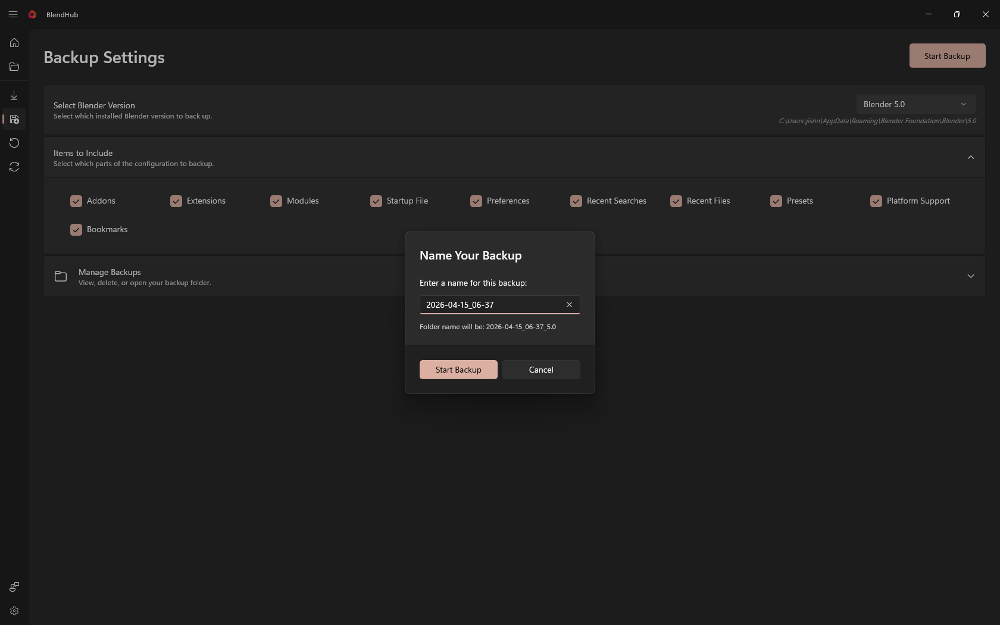

# Backup Page

The Backup Page allows you to create secure backups of your Blender settings, preferences, and configurations. Choose what to include, select the Blender version, and manage existing backups.

## Page Layout

### Header Section
At the top of the page, you'll find the main controls and status information:

- **Backup Settings Title** - Clear page header
- **Status Text** - Shows current backup status or progress information
- **Progress Bar** - Visual progress indicator during backup operations
- **Start Backup Button** - Primary action to begin backup process

### Info Bars
Below the header, you'll find status information bars:

- **Warning InfoBar** - Shows warnings and important messages
- **Error InfoBar** - Displays error messages if backup fails
- **Success InfoBar** - Confirms successful backup completion

### Main Content Area
The main section contains all backup configuration options in organized cards:

## Backup Configuration

### Select Blender Version
Choose which Blender installation to create backup from:

- **Version ComboBox** - Dropdown list of installed Blender versions
- **Version Display** - Shows selected version name
- **Path Information** - Displays installation path of selected version
- **Auto-Selection** - Automatically selects first available version

### Items to Include
Select which parts of Blender configuration to include in your backup:

#### Available Items:
- **User Preferences** - General Blender settings and configurations
- **Add-ons** - Installed add-ons and their settings
- **Key Configurations** - Custom keyboard shortcuts and input settings
- **UI Layouts** - Window layouts and workspace configurations
- **Themes** - Color themes and appearance settings
- **Scripts** - Custom scripts and plugins
- **Startup File** - Default startup blend file

#### Item Selection:
- **Checkboxes** - Individual selection for each backup item
- **Tooltips** - Hover information about each item
- **Existence Status** - Shows if item exists in current installation
- **Grid Layout** - Organized in responsive grid format

### Manage Backups
View, organize, and manage your existing backup files:

#### Backup List:
- **Backup Names** - List of all created backups with timestamps
- **File Information** - Shows backup file details and size
- **Creation Dates** - When each backup was created

#### Backup Actions:
- **Open Folder** - Open backup location in file explorer
- **Delete Backup** - Remove unwanted backup files
- **View Contents** - See what's included in each backup
- **File Management** - Organize and clean up backup files

## How to Use

### Creating a Backup
1. **Select Blender Version** - Choose which installation to backup from
2. **Choose Items** - Select what to include using checkboxes
3. **Review Selection** - Confirm your backup configuration
4. **Start Backup** - Click "Start Backup" to begin process
5. **Monitor Progress** - Watch progress bar and status messages

### Managing Existing Backups
1. **View List** - Browse through existing backups in the manager
2. **Open Location** - Click folder icon to open backup directory
3. **Delete Old** - Remove outdated or unnecessary backups
4. **Check Contents** - View what's included in specific backups

## Tips for Beginners

### Backup Strategy
- **Regular Backups** - Create backups regularly, especially before major changes
- **Selective Backup** - Only include items you actually need to restore
- **Version-Specific** - Create separate backups for different Blender versions
- **Before Updates** - Always backup before updating Blender or add-ons

### Item Selection
- **Essential Items** - Always backup preferences and key configurations
- **Add-ons** - Include add-ons to preserve custom functionality
- **Scripts** - Backup custom scripts and automation tools
- **Storage Space** - Consider backup size when selecting items

### Organization
- **Descriptive Names** - Use clear backup names with dates
- **Regular Cleanup** - Delete old backups to save space
- **Multiple Locations** - Store important backups in different locations
- **Version Tracking** - Keep track of which Blender version each backup uses

## Advanced Features

### Smart Item Detection
- **Automatic Scanning** - Detects available items in Blender installation
- **Existence Checking** - Only shows items that actually exist
- **Dependency Awareness** - Understands relationships between items
- **Validation** - Ensures selected items can be backed up

### Progress Tracking
- **Real-time Updates** - Live progress during backup creation
- **Status Messages** - Detailed information about backup process
- **Error Handling** - Clear error reporting and recovery options
- **Completion Notification** - Success confirmation with backup details

### Responsive Design
- **Adaptive Layout** - Interface adjusts to window size
- **Mobile Support** - Works on different screen sizes
- **Touch-Friendly** - Large touch targets for mobile devices
- **Keyboard Navigation** - Full keyboard accessibility support

## Troubleshooting

### Common Issues
- **No Versions Found** - Ensure Blender is properly installed
- **Backup Fails** - Check file permissions and disk space
- **Items Missing** - Some items may not exist in installation
- **Progress Stuck** - Backup process may hang on large files

### Solutions
- **Refresh Versions** - Re-scan for Blender installations
- **Check Permissions** - Ensure write access to backup location
- **Free Space** - Verify sufficient disk space for backup
- **Selective Backup** - Try backing up fewer items if process fails

### Error Recovery
- **Partial Backups** - Handle incomplete backup scenarios
- **Retry Options** - Automatic retry mechanisms for failed operations
- **Fallback Methods** - Alternative backup approaches
- **Data Integrity** - Verification of backup file completeness

## Best Practices

### Before Backing Up
- **Close Blender** - Ensure Blender is not running during backup
- **Save Work** - Save any open projects before starting
- **Check Updates** - Ensure Blender and add-ons are up to date
- **Plan Selection** - Decide what to include before starting

### After Backing Up
- **Verify Backup** - Test restore process with new backup
- **Document Contents** - Keep notes about what each backup contains
- **Store Safely** - Keep backups in secure, accessible locations
- **Regular Testing** - Periodically test backup restoration

## Keyboard Shortcuts
- **Tab Navigation** - Move between form controls
- **Space Selection** - Toggle checkboxes with spacebar
- **Enter Confirmation** - Start backup with Enter key
- **Escape Cancellation** - Cancel backup process with Escape
