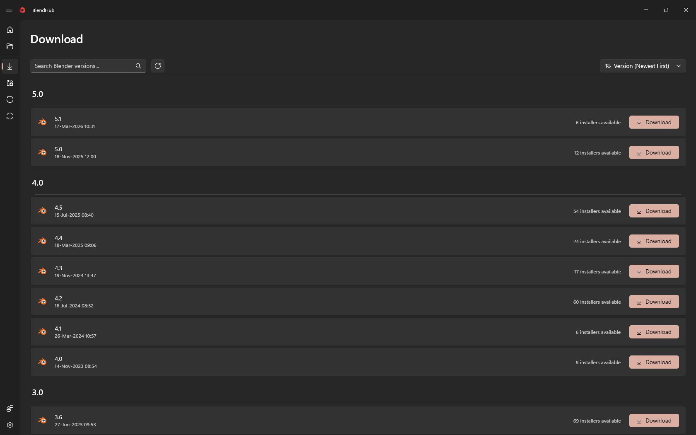
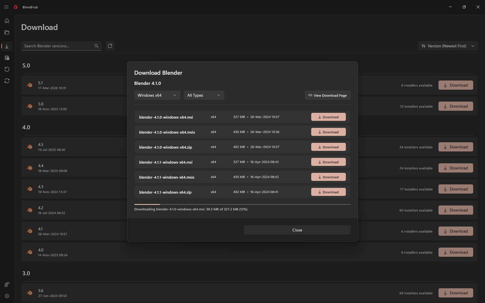

# Download Page

The Download Page allows you to browse, search, and download different Blender versions directly within BlendHub. Access official Blender releases with an organized, searchable interface.

## Page Layout

### Header Section
At the top of the page, you'll find the main title and status indicators:

- **Download Title** - Clear page header
- **Loading Panel** - Shows loading animation and text when fetching versions
- **Error InfoBar** - Displays error messages if version loading fails

### Search and Controls Bar
Below the header, you'll find powerful tools for managing Blender versions:

#### Left Side Controls:
- **Search Box** - Search Blender versions by version number or description
- **Refresh Button** - Reload version list from database
- **Refresh Progress** - Shows spinning animation during refresh

#### Right Side Controls:
- **Sort Button** - Dropdown menu with sorting options:
  - Version (Newest First) - Default
  - Version (Oldest First)

### Version List
The main area displays Blender versions organized in groups with detailed information for each version.

#### Version Grouping:
- **Group Headers** - Versions are organized by release categories
- **Visual Separation** - Clear visual grouping with bold headers
- **Organized Display** - Versions grouped logically for easy browsing

#### Version Cards
Each Blender version appears as a card with:
- **Version Number** - Clear version identification (e.g., "4.2.0")
- **Release Date** - When the version was released
- **Installer Count** - Number of available installers for that version
- **Download Button** - Primary action to download the version

## How to Use

### Browsing Versions
1. **Load Page** - Versions automatically load from the database
2. **View Groups** - See versions organized by release type
3. **Scroll List** - Browse through available versions
4. **Check Details** - Review version information before downloading

### Searching Versions
1. **Type in Search Box** - Enter version number or keywords
2. **Real-time Filtering** - List updates as you type
3. **Clear Search** - Delete text to show all versions
4. **Find Specific** - Quickly locate particular versions

### Sorting Versions
1. **Click Sort Button** - Opens sorting dropdown menu
2. **Choose Order** - Select newest first or oldest first
3. **Apply Changes** - List updates immediately
4. **Persistent Choice** - Your preference is remembered

### Downloading Versions
1. **Select Version** - Click on the version card you want
2. **Open Download Dialog** - Shows detailed download options
3. **Choose Installer** - Select appropriate installer for your system
4. **Start Download** - Begin download with progress tracking

## Download Dialog Features

When you click Download on any version, a detailed dialog appears with:

### Version Information
- **Full Version Number** - Complete version identification
- **Release Date** - Official release date
- **Platform Options** - Available installers for different systems

### Download Options
- **Installer Selection** - Choose from available installer types
- **File Size** - See download size for each option
- **Download Location** - Choose where to save the installer
- **Progress Tracking** - Real-time download progress

## Tips for Beginners

### Finding Versions
- **Use Search** - Type partial version numbers (e.g., "4.2" finds 4.2.0)
- **Check Groups** - Look in different group sections for various release types
- **Sort Appropriately** - Use "Newest First" to find latest versions
- **Refresh Regularly** - Click refresh to get the latest version database

### Downloading Best Practices
- **Check Compatibility** - Ensure version works with your system
- **Stable vs Development** - Choose stable releases for production work
- **Storage Space** - Verify enough disk space before downloading
- **Download During Off-Peak** - Faster downloads during low-traffic times

### Version Selection
- **Latest Stable** - Generally the best choice for most users
- **LTS Versions** - Long-term support versions for stability
- **Development Builds** - For testing new features
- **Specific Versions** - Choose exact versions for project compatibility

## Advanced Features

### Database Integration
- **Offline Database** - Versions loaded from local database
- **Fast Loading** - Quick access without internet dependency
- **Version Metadata** - Detailed information for each release
- **Automatic Updates** - Database updates when available

### Search Capabilities
- **Flexible Matching** - Finds versions by various criteria
- **Instant Results** - Real-time filtering as you type
- **Partial Matching** - Works with incomplete version numbers
- **Case Insensitive** - Search regardless of capitalization

### Grouping System
- **Logical Organization** - Versions grouped by release characteristics
- **Clear Headers** - Bold section headers for easy navigation
- **Visual Hierarchy** - Structured display of version information
- **Expandable Groups** - Easy browsing through categorized versions

## Troubleshooting

### Common Issues
- **Versions Not Loading** - Check if database file exists and is accessible
- **Search Not Working** - Try clearing search text and re-typing
- **Download Fails** - Verify internet connection and disk space
- **Sort Not Applied** - Try selecting a different sort option

### Solutions
- **Refresh Database** - Click refresh button to reload version data
- **Check Search Terms** - Use partial version numbers or keywords
- **Verify Storage** - Ensure sufficient disk space for downloads
- **Restart Page** - Navigate away and back to reset the page

## Error Handling

### Loading Errors
- **Error Messages** - Clear error display in InfoBar
- **Retry Options** - Refresh button to retry failed operations
- **Fallback Behavior** - Graceful handling of missing data
- **User Feedback** - Informative error messages

### Download Issues
- **Progress Tracking** - Visual feedback during downloads
- **Failure Recovery** - Clear error reporting for failed downloads
- **Retry Mechanisms** - Options to retry failed downloads
- **Status Updates** - Real-time status information

## Keyboard Shortcuts
- **Search Focus** - Click in search box or use Tab to navigate
- **Clear Search** - Select all text in search box and delete
- **Sort Menu** - Use arrow keys in sort dropdown
- **Navigate List** - Use arrow keys to browse version list