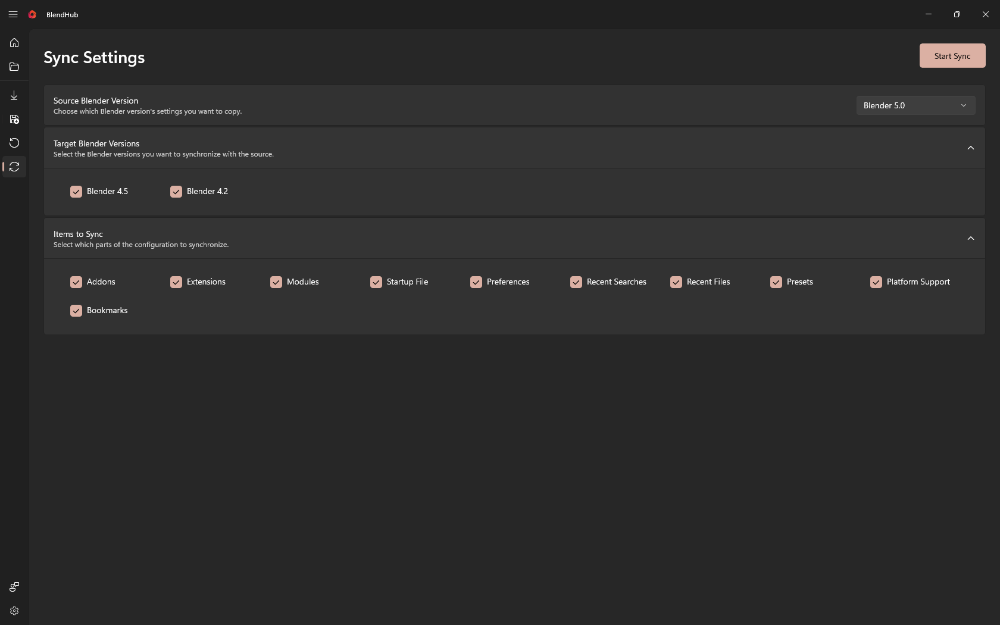

# Sync Page

The Sync Page allows you to synchronize Blender settings and configurations across different installed versions. Choose a source version, select target versions, and specify which items to synchronize.

## Page Layout

### Header Section
At the top of the page, you'll find the main controls and status information:

- **Sync Settings Title** - Clear page header
- **Status Text** - Shows current sync status or validation messages
- **Progress Bar** - Visual progress indicator during sync operations
- **Start Sync Button** - Primary action to begin synchronization process

### Info Bars
Below the header, you'll find status information bars:

- **Warning InfoBar** - Shows warnings and validation messages
- **Error InfoBar** - Displays error messages if sync fails
- **Success InfoBar** - Confirms successful synchronization completion

### Main Content Area
The main section contains all synchronization configuration options in organized cards:

## Sync Configuration

### Source Blender Version
Choose which Blender installation to copy settings from:

- **Source Version ComboBox** - Dropdown list of installed Blender versions
- **Version Display** - Shows selected source version name
- **Auto-Selection** - Automatically selects first available version
- **Change Detection** - Updates available items when source changes

### Target Blender Versions
Select which Blender installations to synchronize settings to:

#### Target Selection:
- **Version List** - Grid of all installed Blender versions except source
- **Checkboxes** - Individual selection for each target version
- **Version Names** - Clear display of each Blender version
- **Multi-Select** - Can select multiple target versions simultaneously
- **Grid Layout** - Organized in responsive grid format

### Items to Sync
Select which parts of Blender configuration to synchronize:

#### Available Items:
- **User Preferences** - General Blender settings and configurations
- **Add-ons** - Installed add-ons and their settings
- **Key Configurations** - Custom keyboard shortcuts and input settings
- **UI Layouts** - Window layouts and workspace configurations
- **Themes** - Color themes and appearance settings
- **Scripts** - Custom scripts and plugins
- **Startup File** - Default startup blend file

#### Item Selection:
- **Checkboxes** - Individual selection for each sync item
- **Tooltips** - Hover information about each item
- **Existence Status** - Shows if item exists in source installation
- **Grid Layout** - Organized in responsive grid format
- **Two-Way Binding** - Changes are immediately reflected

## How to Use

### Setting Up Sync
1. **Select Source** - Choose which Blender version to copy settings from
2. **Choose Targets** - Select one or more target versions to sync to
3. **Select Items** - Choose what configuration parts to synchronize
4. **Validate Setup** - Ensure all selections are valid
5. **Start Sync** - Click "Start Sync" to begin process

### Managing Targets
1. **Review Available** - See all installed Blender versions in target list
2. **Multiple Selection** - Select multiple targets for batch synchronization
3. **Version Compatibility** - Consider compatibility between source and targets
4. **Selective Sync** - Choose only necessary targets to avoid conflicts

### Item Selection
1. **Source Items** - Review what's available in source version
2. **Target Compatibility** - Consider which items work with target versions
3. **Selective Sync** - Only sync necessary configuration items
4. **Avoid Conflicts** - Skip items that might cause issues in targets

## Tips for Beginners

### Sync Strategy
- **Version Hierarchy** - Sync from newer to older versions for compatibility
- **Selective Sync** - Only sync items that are compatible across versions
- **Test Targets** - Try syncing to a test version first
- **Backup First** - Create backup before major sync operations

### Source Selection
- **Latest Version** - Use newest version as source for most complete settings
- **Stable Source** - Choose stable release for reliable configuration
- **Custom Settings** - Source version should have your preferred setup
- **Add-on Awareness** - Consider which add-ons you want to sync

### Target Management
- **Multiple Targets** - Sync to several versions at once for efficiency
- **Version Matching** - Target similar versions for better compatibility
- **Selective Sync** - Don't sync to incompatible versions
- **Batch Operations** - Group similar versions for batch synchronization

## Advanced Features

### Smart Validation
- **Real-time Checking** - Validates selections as you make them
- **Compatibility Detection** - Checks source and target version compatibility
- **Existence Verification** - Ensures selected items exist in source
- **Dependency Awareness** - Understands relationships between items

### Progress Tracking
- **Real-time Updates** - Live progress during sync process
- **Status Messages** - Detailed information about sync progress
- **Error Handling** - Clear error reporting and recovery options
- **Completion Notification** - Success confirmation with sync details

### Responsive Design
- **Adaptive Layout** - Interface adjusts to window size
- **Mobile Support** - Works on different screen sizes
- **Touch-Friendly** - Large touch targets for mobile devices
- **Keyboard Navigation** - Full keyboard accessibility support

## Troubleshooting

### Common Issues
- **No Source Selected** - Validation prevents sync without source version
- **No Targets Selected** - Must select at least one target version
- **No Items Selected** - Must select at least one item to sync
- **Version Conflicts** - Source and target versions may be incompatible

### Solutions
- **Select Source** - Choose a valid Blender version as source
- **Select Targets** - Choose at least one target version
- **Select Items** - Choose at least one configuration item
- **Check Compatibility** - Ensure versions are compatible for sync

### Error Recovery
- **Partial Syncs** - Handle incomplete synchronization scenarios
- **Retry Options** - Automatic retry mechanisms for failed operations
- **Rollback Support** - Ability to undo failed sync attempts
- **Data Integrity** - Verification of synchronized data completeness

## Best Practices

### Before Syncing
- **Close Blender** - Ensure Blender is not running during sync
- **Backup Targets** - Create backup of target versions before sync
- **Check Versions** - Verify all versions are properly installed
- **Plan Selection** - Decide what to sync before starting

### After Syncing
- **Verify Functionality** - Test that synced settings work correctly
- **Check Add-ons** - Ensure synced add-ons function in targets
- **Validate Preferences** - Confirm all preferences are applied correctly
- **Restart Blender** - Restart target versions to apply synced settings

## Keyboard Shortcuts
- **Tab Navigation** - Move between form controls
- **Space Selection** - Toggle checkboxes with spacebar
- **Enter Confirmation** - Start sync with Enter key
- **Escape Cancellation** - Cancel sync process with Escape
